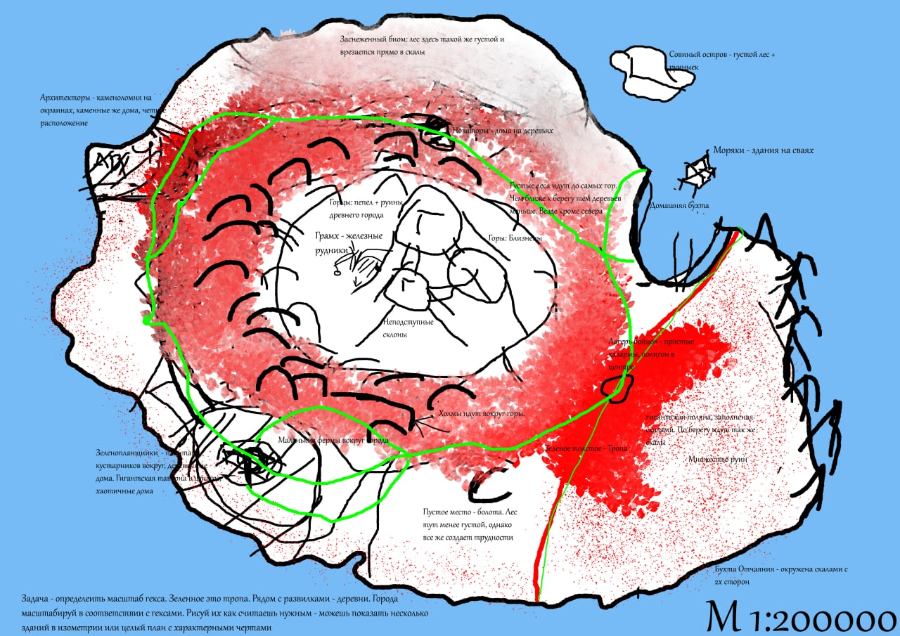
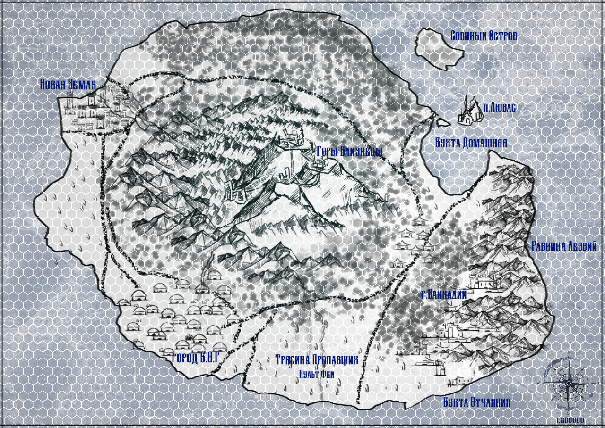
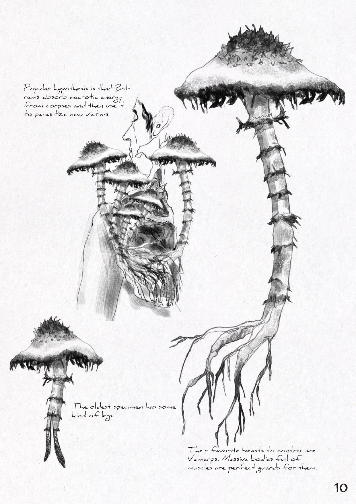
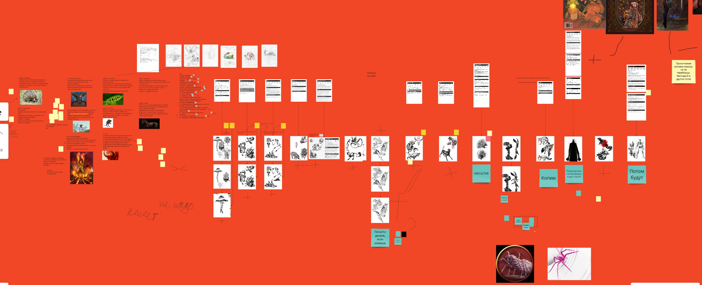
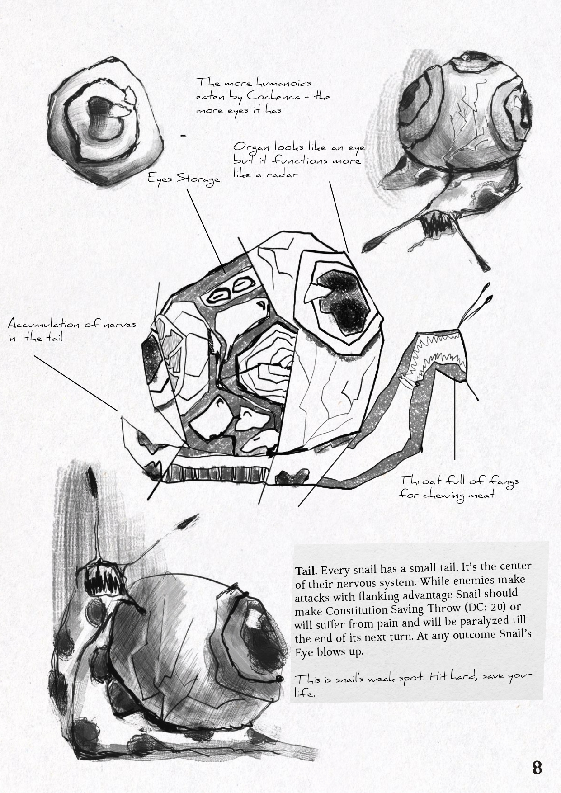

The most ambitious project of the creative association "Seals & Faces".
## Intro
If I'm not mistaken, it was in my second year of study. My apartment had recently flooded, and I moved to a smaller one on the outskirts of Kharkiv. There, in the cramped walls of an unknown room, we made big plans.

Our DnD group collapsed due to moving and internal conflicts. I had some free time and started driving for other companies for money. The process of gathering a team that was willing to pay and not miss sessions was very stressful. I was looking for other ways to make money.

And now, before my eyes, [Tome of Undeath] (https://www.enworld.org/threads/tome-of-undeath.677007/) is coming out (this thread is the only mention of it on the Internet that remains). This book was written by an online friend of mine who was a bit more knowledgeable about TTRPGs and game design in general. It was a book about different kinds of undeads. And just as importantly, her book was a commercial success, which greatly inspired our team.

Without hesitation, we decided that we wanted a bestiary too.

## Concept
I had a very clear vision of what I wanted. I loved hardcore, suspense and weird stuff. The idea of an island where every animal was mutated and became deadly just came out of our daily conversations. Many years later, I realized that this was a very short-sighted decision, given that I was using the DnD5 system.

Anyway, I was running a DnD campaign for money for people I didn't know, and at the same time the concept of the island was born. The game was similar to West Marches, where players slowly explored the map, opening hexes and finding new adventures.

And it was from the adventures and problems of that group that new ideas were born. I was annoyed by the one-dimensional nature of the combat in DnD and started doing what any normal DnD newbie does - I started homebrewing.

 

## Monsters

### Weaknesses

Each of the monsters had its own "weakness". Using the existing system of statuses and resistances, I wanted to give players an advantage in battle that would depend on the amount of knowledge they had accumulated. So all the enemies turned out to be deadly, but at the same time had some critical flaw that instantly made them less powerful.

The easiest example is the Candams. Telepathic dogs (it even sounds funny) that use their powers to work well in a group and are quite dangerous.

But, thanks to their telepathic sensitivity, they are also an easy target for all charming spells. Thus, after charming one of them, each of them will have to make a saving throw.

### Teamwork
I was also interested in creating monsters that could synergize with each other, creating particularly dangerous combinations. Unfortunately, I couldn't come up with a systematic solution for this. Instead, I created several monsters that work well together in pairs and essentially create a new combat unit together.

That's how we got the Vamerps (vampire boars) and the Bolrem (necromancer mushrooms). The Vamerps were strong, but because of their animalistic anger, they were quite easy to stop. Bolremes, of course, revive the corpse and deprive it of such things as emotions.

 

### Mutations and conceptualization
What turned out to be really cool was the process of generating ideas. We managed to capture this process by simplifying each creature to the animal+feature string. As you can see, each of the monsters I described above is just such a construction.

This conceptualization helped us to iterate ideas and come up with new ones very quickly. After this process, we were left with a ton of ideas, which we decided to put into a separate section called Zombie-Mutants. This is a table of 100 mutations that could be used to create new monsters relatively quickly. 

But, to be honest, looking at this table now, it seems to me that most of the mutations are completely meaningless. Just like in real life, lol.

## Coclusion

### What turned out well

Well, the process was incredibly fun. Yes, there were crunches. Yes, we were running out of time. Yes, Dasha and I had an uni exams coming up and it was very difficult. But it was cool in the process, right?

The book itself, although it has some big problems at its core, is nevertheless a great work and I'm glad I did it.

In addition, I improved my English quite a bit, thanks to our editor, Vlad.

### What turned out badly and what we learned

#### General
It was a commercial failure. We couldn't get our book seen by anyone. And even though after [Kromvel]() we came to the conclusion that we had no fan base, no marketing, and no support from social media, we didn't do enough to advertise and gather feedback.

So, at the end of the development, I tried to negotiate with an old friend of mine to join our group as a SMM. And he seemed to agree, but in the end, we were still left in the puddle.

If we had started collecting feedback and looking for coverage on social media from the very first concepts, this situation might not have happened.

#### Graphics
The illustrations were incredible. But my level of layout was not up to par. At that time, I was very bad at working with references. Even though we had a clear reference in the form of Tome of Undeath, I couldn't realize that aesthetic.

 

#### Gameplay
Much later, I realized that the problems I was trying to solve with this Bestiary were much more deeply buried in the very essence of the DnD5 system.

The very focus of the game is not designed for West Marches, a complex combat system, or knowledge-based mechanics. They had to be solved not by changing monsters and mechanics, but by choosing other tools. Namely, a different role-playing system.

And the monsters turned out to be too complicated. And there were not enough playtests. In fact, I'm telling you here, there were almost none at all.
## In short
I wouldn't say it was as bad as I'm describing. Rather, I'm sure that at that moment we COULD have done better. The fact that we didn't do it means that we didn't reflect enough and get feedback.

And this, in turn, was because WE WERE BURNING, WE WERE ON FIRE, WE HAD A LOT OF F-U-N.

And I don't regret a bit that it turned out the way it did. Every nerve cell was worth it.

FRY MONSTERS AND DRINK MILK.

E.S

You could download [Bestiary of very very strange mutatnts here](https://www.dmsguild.com/product/361436/Bestiary-of-Very-Very-Strange-Mutants?term=Bestiary+of+very+very)

Previous - [about Kromvel]() 