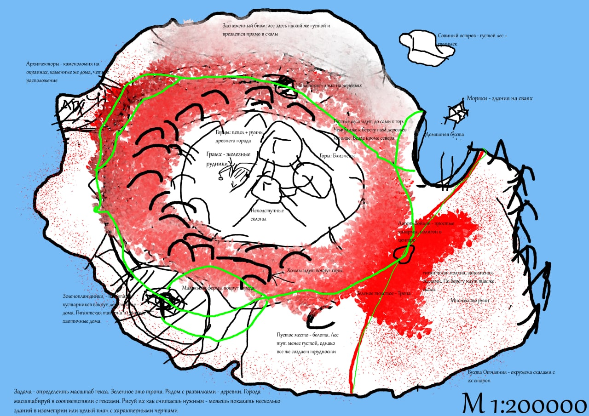
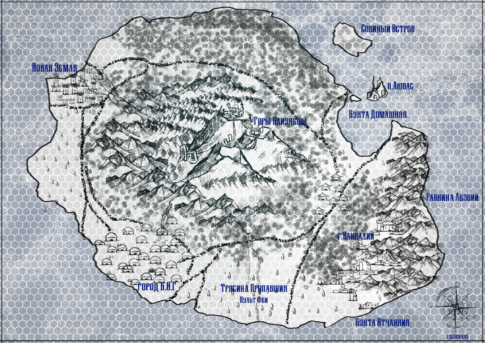
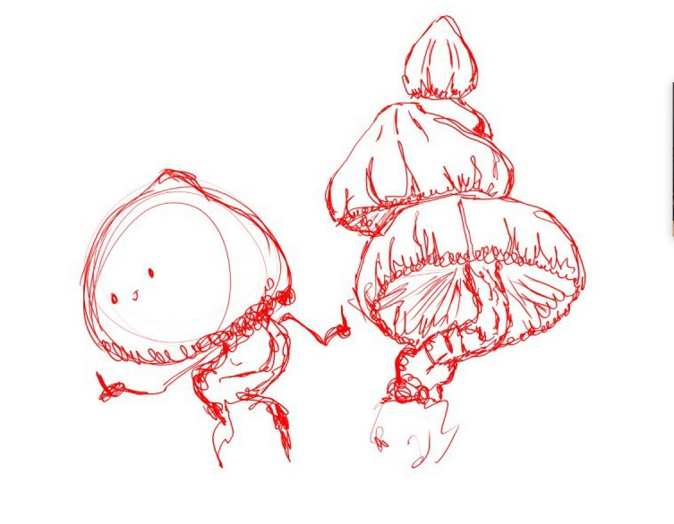
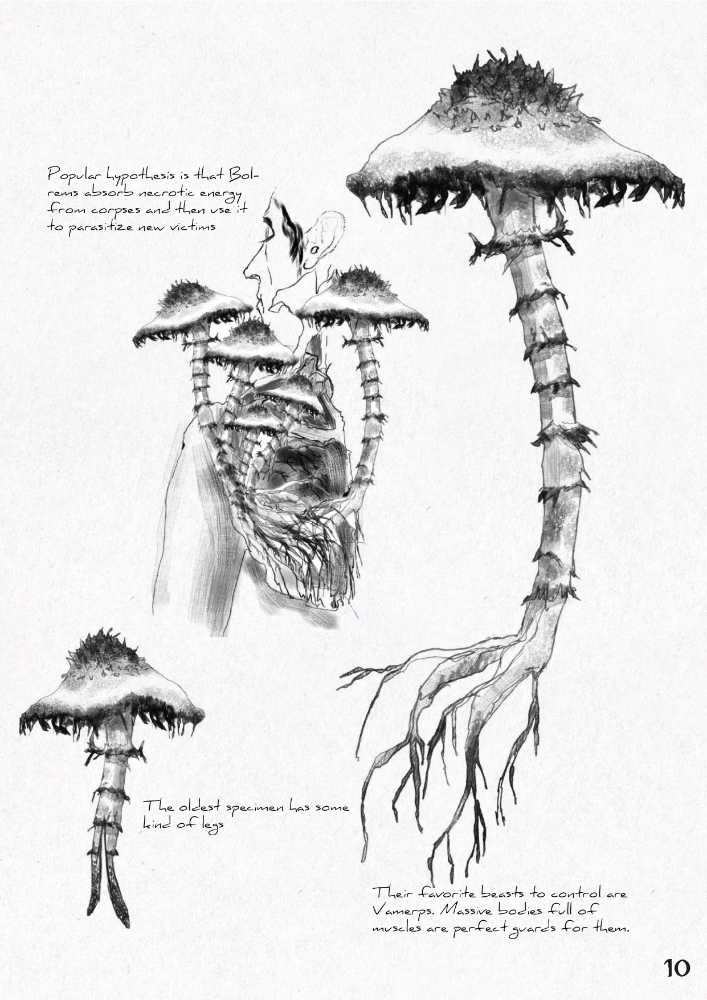
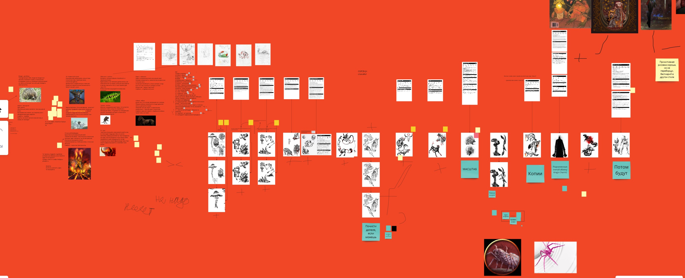
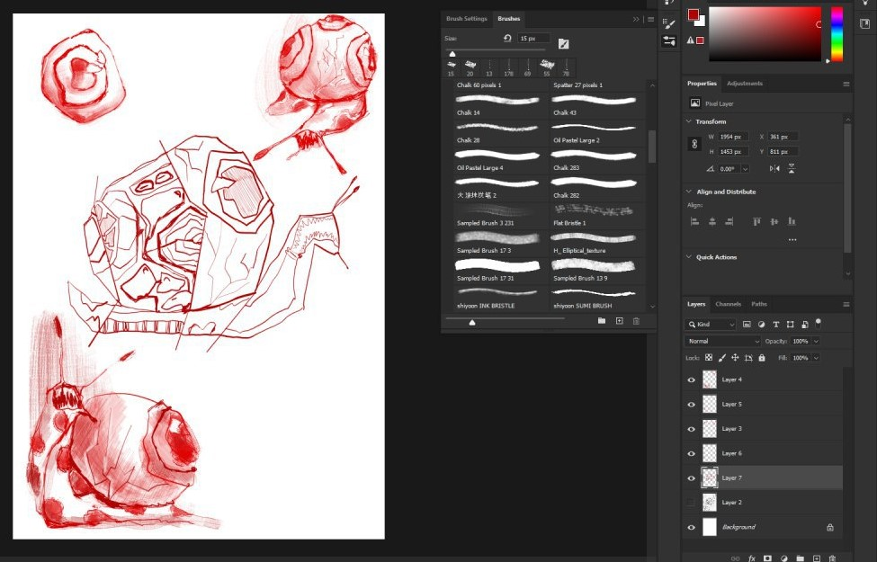
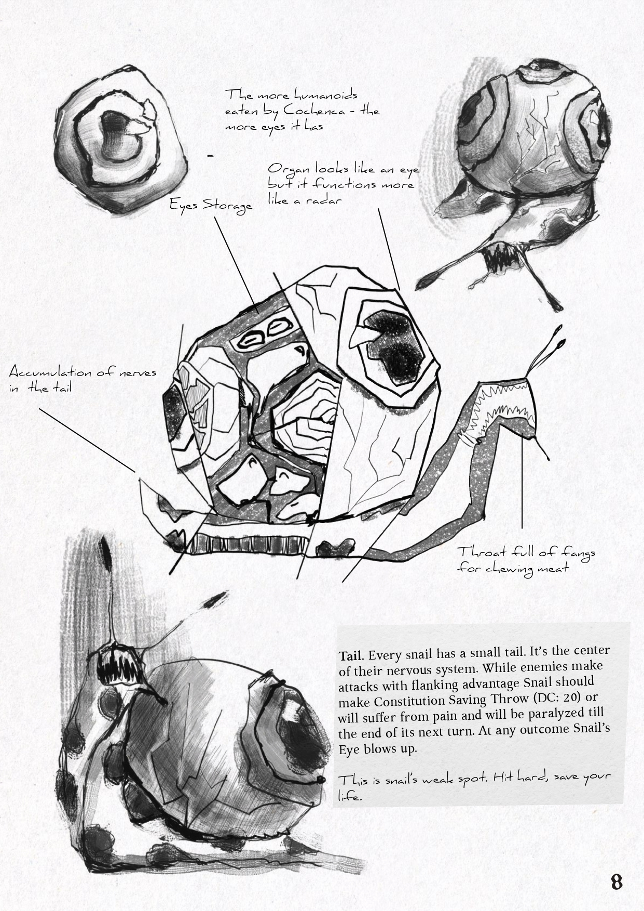

Найбільш амбітній проєкт творчого об'єднання "Тюлені&Обличчя".
## Intro
Якщо не помиляюсь, то це було вже на другому курсі. У мене нещодавно затопило квартиру, я переїхав у більш маленьку на окраїні міста Харків. Там у тісних стінах невідомої гостинки, ми створювали великі плани.

Наша ДнД група розвалилась, через переїзд та внутрішні конфлікти. У мене звільнився час і я почав водити за гроші іншим компаніям. Процес збору команди, що була готова платити і при цьому не пройобувати сесії був дуже напруженим. Я шукав інші варіанти заробітку.

І ось на моїх очах виходить [Tome of Undeath](https://www.enworld.org/threads/tome-of-undeath.677007/) (цей тред, це єдина згадка про нього в інтернеті, що залишилась). Ця книжка була написана моєю онлайн знайомою, яка була трошки більш  обізнана і НРІ і в геймдизайні в цілому. Це була книга про різні види нежиті. І що не менш важливо - її книга мала комерційний успіх, що дуже надихнуло нашу команду.

Недовго думаючи ми вирішили, що ми теж хочемо бестіарій.

## Концепт
Я мав дуже чіткий віжн того чого я хочу. Я любив хардкор, напруження і дивні штуки. Ідея з островом на якому кожна тваринка мутувала і стала смертельно небезпечною - дуже просто органічно витік із наших щоденних розмов. Вже багато років потому я зрозумів, що це дуже недалеке рішення, враховуючи, що я використовував ДнД5 систему.

Ну, короче, я вів кампейн за бабки людям, яких не знав і паралельно народжувалась концепція острову. Гра була схоже на вест-марші, де гравці повільно вивчали карту, відкриваючи гекси і знаходячи нові пригоди.

І з саме пригод та проблем тієї групи і народжувались нові ідеї. Мене дратувала одномірність бойовки в ДнД і я почав робити те що робить будь-який нормальний новачок в деху - почав хоумбрюшить.

 

## Монстри

### Слабкості

Кожен з монстрів мав свою "слабкість". Використовуючи існуючу систему статусів та спротивів, я хотів давати гравцям перевагу в бою, яка б залежала від кількості накоплених знань. Так всі вороги вийшли смертельно небезпечними, але при цьому мали якийсь критичний недолік, який миттєво робив їх менш сильними.

Найбільш легким прикладом, можна назвати Кандамів. Собаки-телепати (навіть звучить кумедно), що за допомогою своїх сил чудово діють в групі і є доволі небезпечними.

Але, завдяки їх телепатичній чутливості вони і легка ціль для всіх заклять, що діють на разум жертви. Так, зачарувавши одну з них, кожна повинна буде робити сейв кидок.

### Робота в групі

Також мені цікаво було створювати таких монстрів, що могли би синергувати між собою, створюючи особливо небезпечні зв'язки. Нажаль, системного рішення я придумати для цього не зміг. Замість цього я створив декілька монстрів, що чудово працюють між собою в парах та по суті разом створюють нову бойову одиницю.

Так у нас запрацювали Вамерпи (кабани-вампіри) та Болреми (гриби-некроманти). Вамерпів були сильні, але через їхню тваринний гнів, їх було доволі легко зупинити. Болреми, звісно ж, оживляючи труп позбавляють його такої штуки як емоції.

 

### Мутації та концептування

Що вийшло, дійсно круто, так це процес генерації ідей. Вийшло спіймати цей процес за допомогою сімпліфікації кожного створіння до рядка тварина-особливість. Як ви можете помітити, кожен з монстрів, якого я описував вище є саме такою збіркою.

Таке концептування допомогло нам дуже швидко ітерувати ідеї та виносити нові. Після цього процесу  у нас залишилась просто тонна ідей, які ми вирішили винести в окремий параграф "Zombie-Mutants". Це таблиця з 100 мутацій за допомогою яких можна було б створювати нових монстрів відносно швидко. 

Але, якщо чесно, передивляючись цю таблицю зараз, мені здається, що більшість мутацій абсолютно безглузда. Як і в реальному житті, лол.

## Підсумок

### Що вийшло гарно

Ну, процес був неймовірно веселим. Так, були кранчі. Так, ми нічо не встигали. Так, у нас з Дашею, як-раз була сесія на носу і було дуже важко. Але в процесі ж було круто?

Сама книга хоч і має в своїй основі декілька великих проблем, але тим не менш є чудовою роботою і я радий, що її зробив.

Крім того, я доволі сильно прокачався в англійській, завдяки нашому редактору - Владу.

### Що вийшло погано і чому ми навчились

#### Загальне
Це була комерційна невдача. Ми не змогли зробити так, щоб нашу книгу, хоч хтось побачив. І хоч після [Кромвеля]() ми зробили висновки про те що у нас не було фанбази, не було маркетингу та ніякої підтримки соцмедіа, ми не зробили достатньо, щоб прорекламуватись та зібрати фідбек.

Так, вже під кінець розробки я намагався домовитись зі своїм старим знайомим, про його приєднання до нашої групи у якості СММ. І, начебто, він навіть погодився, але в кінці в калюжі все одно залишились ми.

Якби ж ми з самих перших концептів почали збирати фідбек та шукати освітлення в соцмережах, то можливо, такої ситуації би не виникло.

#### Графіка
Ілюстрації були неймовірні. Але мій рівень верстки до нього не дотягував. У той час я дуже погано працював з референсами. Хоч у нас і був чіткий орієнтир у вигляді Tome of Undeath, але я не зміг втілити ту естетику.

 

#### Геймплейно
Вже сильно пізніше, я зрозумів, що проблеми, які я намагався вирішити цим Бестиарієм, набагато глибше закопані у саму сутнітність системи DnD5.

Сам фокус гри не розрахований на проведення вест-маршів, складну бойову систему чи knowledge-based механіки. Їх потрібно було вирішувати не зміною монстрів та механік, а вибором інших інструментів. А саме іншої рольової системи.

Та і монстри вийшли заскладні. Та і плейтестів було замало. Та що я вам тут розказую, їх майже взагалі не було.

## Ну короче
Я би не сказав, що вийшло, так погано як я описую. Скоріше, я впевнений, що у той момент ми ВЖЕ могли краще. Те що ми не владнались з цим свідчить про те що ми недостатньо рефлексували та отримували фідбеку.

А це в свою чергу було через те що МИ ГОРІЛИ, МИ ПАЛАЛИ, НАМ БУЛО ОФІГЕЗНО ВЕ-СЕ-ЛО.

І я ні краплі не жалкую, шо вийшло так, як вийшло. Кожна нервова клітина була того варта.

СМАЖТЕ МОНСТРІВ ТА ПИЙТЕ МОЛОКО.

E.S.

Ви можете скачать [Бестиарій дуже-дуже дивних мутантів тут](https://www.dmsguild.com/product/361436/Bestiary-of-Very-Very-Strange-Mutants?term=Bestiary+of+very+very)

Минула сторінка - [про Кромвель]() 