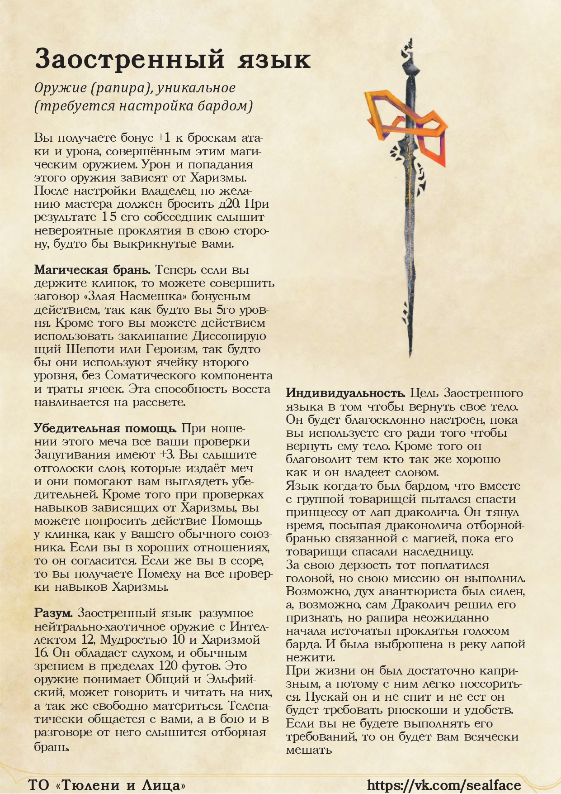
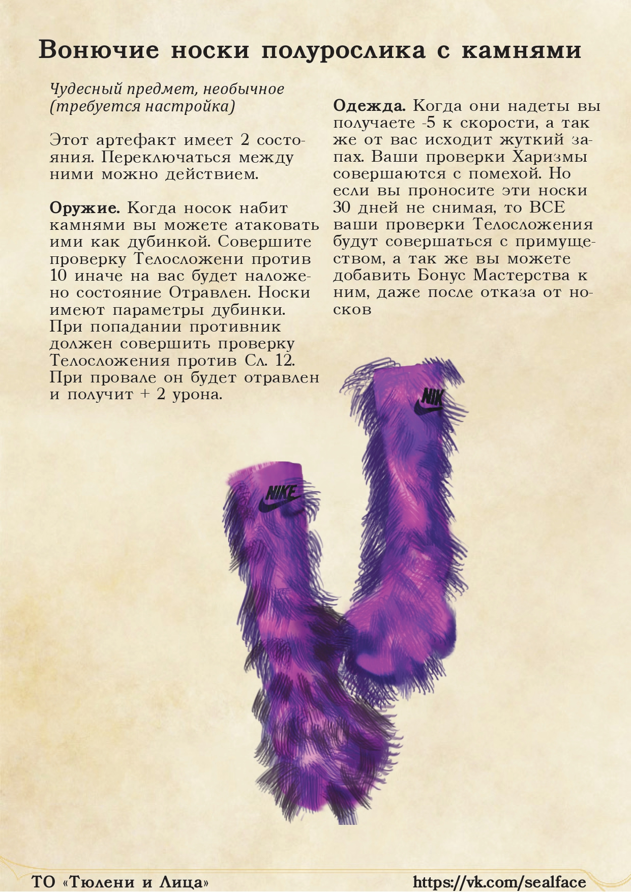

I think this is the farthest date that I can mark as the start of my personal creative work in narrative and game design.

## Context
In general, it was a great time. I had just moved from Dnipro to Kharkiv to study at the Kharkiv School of Architecture. It was my first attempt at independent living, the freedom made me crazy and I quickly started looking for adventures and money. Very soon, a small group of like-minded people formed around me. 

We played DnD together. Our adventures were full of all kinds of fun, violence, and friendship. I was the GM and I saw our games as scenarios that I had to invent. The idea of becoming a game designer was just forming in my head. It was a great time.

## Contests
Suddenly, I found out that I had Talents in my group. Or rather, our barbarian was a very talented artist. I came across a post from a group called "Vsrati DnDshniki" (back then in VK). They were announcing a contest for the best dungeon concept. And their prize, oh my God, was a whole paper set for creating dungeons in real life. I couldn't resist.

Suddenly, I find out that I have talents in my group. Our barbarian was a very talented artist. I came across a post from a group called "Fuckin' DnDplayers" (untranslatable). They were announcing a contest for the best dungeon concept. And their prize, oh my God, was a whole paper set of dungeon tiles. I couldn't resist.

That's when our creative group, Seals & Faces came into being. I remember calling Dasha on a summer day in 2020 and shouting into the phone: "I'VE COME UP WITH A NAME! We're going to be sealing (? another untranslatable shit. Believe me it makes sense in ukrainian)". 

Anyway, I had problems with naming even then.

Then we took part in contests for creating artifacts, for new homebrews, and I think for something else. These were quite niche contests and we easily took the top 1. However, we never received the prizes, because of the postal problems between Russia and Ukraine.

I'm adding pictures of what we made below.

### Artifacts
 

### And whole dungeon
   

## Acilo
At some point I decided that our tandem for Seals and Faces was not enough. I wanted ***collective creativity***. And I called on our DnD group to start by creating a universe in which we would play. Everyone was quite enthusiastic about the idea. I was in charge of text and layout, Dashka (our barbarian - genasi) was responsible for illustrations, and everyone else was generating ideas.

Each of us was given a task to write a text about one of the countries of our imaginary universe - Acilo. I tried to divide the work so that we could mix different writing styles, make ideas more interesting, etc. However, it turned out that I had to write most of it anyway

The main goal of this book was to introduce new players to our setting. We had a lot of general ideas, as well as events that we had already played. It was quite difficult to explain everything in words to an outsider.

I don't think I thought much about the global concept at the time, but if I were to single out something, it would be *Gods*. Every race, every country had a different attitude to the concept of a divine power. Some hated it, some used it, some created it. The only thing that united them was the absence of doubt that the gods were real.

Our setting also had a special feature. Back then, I couldn't restrain myself in my game design impulses and wanted to transfer the mechanics of creating wands from Noita to paper. At that time, this game impressed me a lot. I spent a whole campaign on the creation of artifacts, their origins, and all that. In the end, I didn't really come up with a good mechanic, but it's still a lot of fun to think about it.

You can read "Pain and Suffering in Acilo" [here](https://drive.google.com/file/d/1qVA00qspJ3dSjpEvCebWW_C5yBsXPN02/view?usp=drive_link). (Warning: Russian text)

Next page: [[Kromvel]]