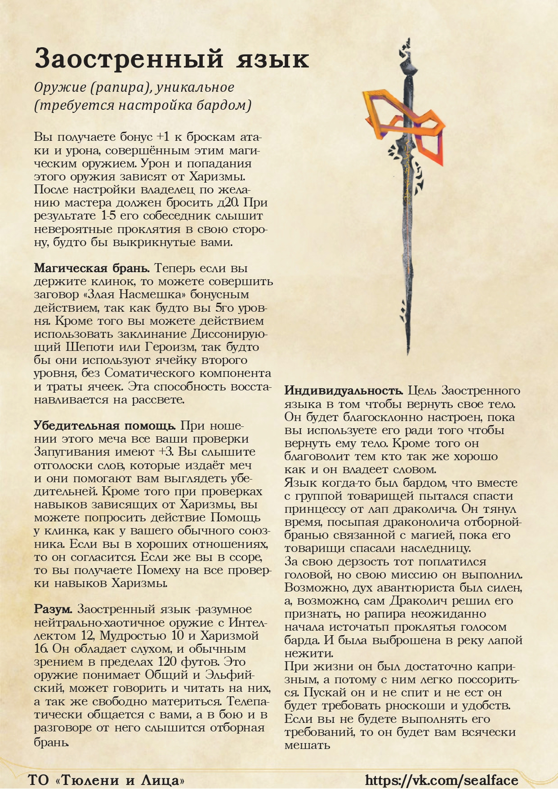
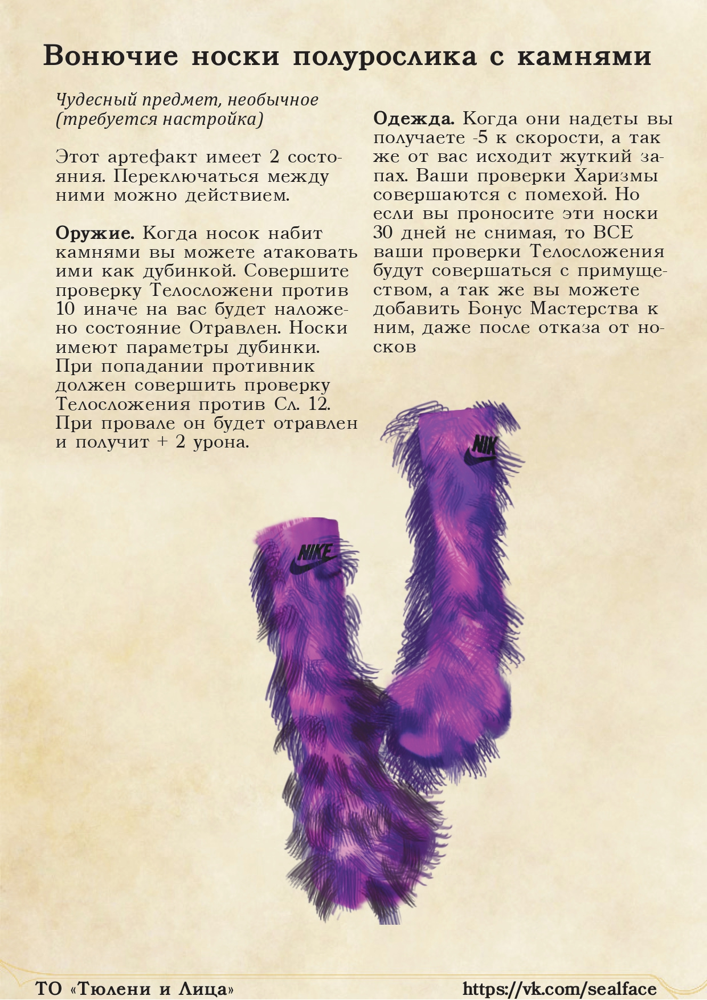
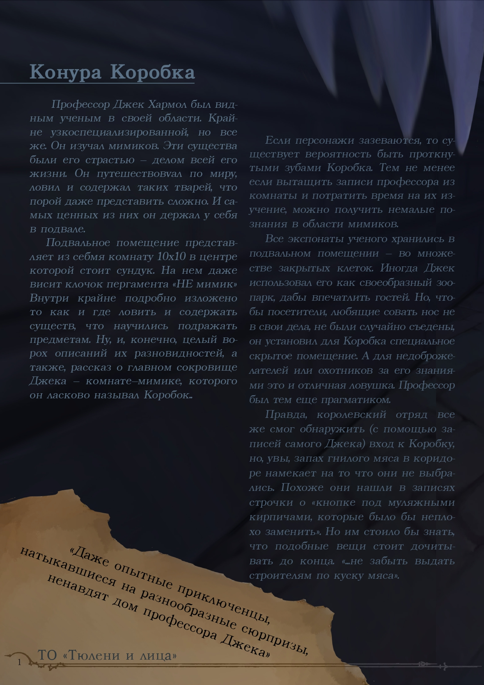
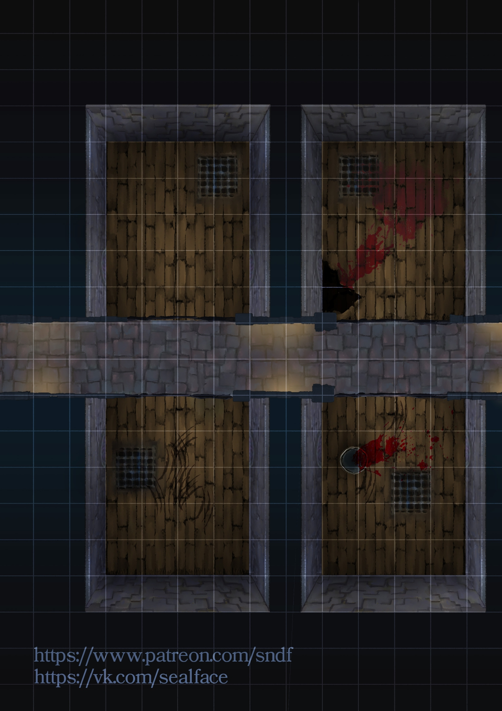
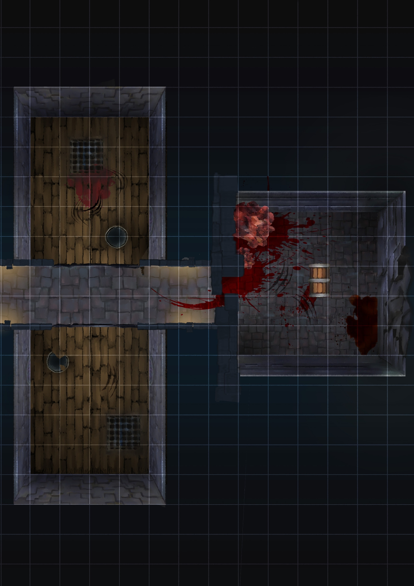

Я думаю, що це найбільш далека дата, яку я можу відмітити як старт своєї персональної творчості у наративі та геймдизайні.

## Context
Загалом то був чудовий час. Я тільки-но переїхав з Дніпра у Харків для навчання у Харківській Школі Архітектури. Це був перша спроба самостійного життя, свобода запаморочила мені голову і я швидко почав шукати собі пригод і грошей. Дуже швидко навколо мене, сформувалась невеличка групка однодумців. 

Разом ми грали в ДнД. Наші пригоди були сповнені всілякою веселощами, насиллям та дружбою. Я був ГМом і сприймав наші ігри наче сценарії, які мені потрібно було вигадувати. У мене в голові тільки формувалась ідея стати геймдизайнером. Це був чудовий час.
## Конкурси
Раптово я дізнаюсь, що у мене в групі є Таланти. А точніше наша варварка була дуже здібною художницею. Мені на очі (ще тоді у ВК) попадається пост від групи під назвою "Всраті ДнДшники". Вони об'являють конкурс на найкращий концепт данжу. А приз у них, о боже мій, цілий паперовий набір для створення підземель в реалі. Я не зміг встояти.

Тоді і з'являється наше ТО - "Тюлені і Обличчя", або "Seals&Faces". Я пам'ятаю як літнім днем 2020го року я дзвоню Дашці і волаю в трубку: "Я ПРИДУМАВ НАЗВУ! МИ БУДЕМО ТЮЛЕНИТЬСЯ (Тюлени и Лица)". 

Ну короче, з неймінгом у мене вже тоді були проблеми.

Потім ми взяли участь в конкурсах на створення артефактів, на нові хоумбрю, та здається ще на щось. Це були доволі нішеві конкурси і ми з легкістю займали топ-1. Однак, призи до нас так і не доїхали)

### Артефакти
 

### І ціле підземелля
   

## Ацило
В якийсь момент я вирішив, що нашего тандему для Тюленів і Обличь недостатньо. Я бажав ***колективної творчості***. І закликав нашу ДнД групу почати з створення всесвіту у якому ми будемо грати. Всі доволі бадьоро сприйняли цю ідею. Я займався текстом і версткою, Дашка (наш варвар - дженазі) - ілюстраціями, а всі інші - генерацією ідей.

Кожному була дана задача написати текст про одну із країн нашого уявного всесвіту - Ацило. Я намагався розділити труд щоб у нас змішались різні стилі написання, ідеї були цікавішими тощо. Проте вийшло так, що більшість всього прийшлося все одно писати мені.

Головною метою цієї книжки була можливість введення нових гравців в наш сетінг. Загальних ідей у нас було багато, як і подій. А пояснювати все словами людині зі сторони - було доволі складно.

Не думаю, що тоді я сильно замислювався над глобальною концепцією, але якщо щось виділяти, то це *Богів*. У кожної раси, у кожної країни було різне ставлення до концепції вищої сили. Хтось ненавидив, хтось використовував, хто створював. Єдине, що їх об'єднувало: відсутність сумнівів у тому що боги реальні.

Ще у нашого сетінгу була фішка. Тоді я не міг стримувати себе у геймдизайнерських поривах і хотів передати на папір механіку створення паличок з Noita. У той час ця гра ДУЖЕ сильно мене вразила. Ще цілий кампейн провів про створення артефактів, їх походження і все таке. У підсумку правда нормального механа не вийшло, але згадувати про це дуже весело.

Погортати "Біль і Страждання в Ацило" можна ось [тут](https://drive.google.com/file/d/1qVA00qspJ3dSjpEvCebWW_C5yBsXPN02/view?usp=drive_link). (Warning: Russian text)

Наступна сторінка: [[Kromvel]]