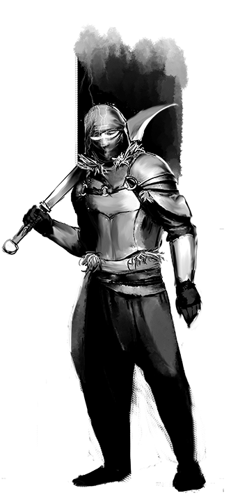

## Context
I remember that night in December. It still resonates deep in my heart. It was a real test for me as a dungeon master. There were 2 new players in the game, and I was leading a oneshot that should have been stretched over 4 sessions. Instead, we played from 3 pm on the first day until 8 am on the second. I have never drunk so many energy drinks and hope to never drink them again.

But the players were absolutely delighted. Without hesitation, we decided that we should pass this on to our descendants and maybe make some money from it.

## How it was
It was primarily conceived as a commercial project. That's why we wrote in English and posted it on dmsgild, hoping to make a couple hundred dollars. My English wasn't bad, but also it wasn't good enough for people to enjoy my writing.

That's why we were brought in by the third permanent member of the group, the editor - Vlad, who lived in London and was practically a native speaker (although he was from Moldova). He is a dear person to me, my mentor and good friend, with whom we used to play Hots and DoTA2. And we dreamed of going to The International together and drinking beer together.

Together, we put down on paper all the adventures that happened to us that day. And we started a long and tense process of proofreading and polishing.

## General
The purpose of the oneshot was to expand Acilo setting. I wanted to show that there is life in countries where the group is unlikely to ever visit. And that those events should have an impact on the main campaign.

We moved to a distant northern city called... Kromvel. This is the last outpost of humanity in these lands. From there, it's just snow, monsters, and a tier S Noite artifact that had just been spotted on magical radar. The group had to reach the target and teleport away. The only difficulty is that the enemy organization has already started hunting and arrived there before ours. So we had to hurry!

For the first time, my players felt not like hobos, but like fully-fledged members of society. I gave them artifacts and gold, and they were members of a very respected group of artifact hunters.

## Plot
The city itself was very hostile. Immediately, the players are being followed, and getting transportation is a separate quest. On the way, they will encounter an ambush with a giant crab, a blizzard, hospitable giants, and a dead tavern.

As well as dungeons and a big and grandiose battle on a frozen lake!The scale was definitely not vanshot. But I really liked how the game mechanics started interacting with the narrative at that moment. I had an explanation for absolutely everything. Why was the big crab part of the ambush? Because the bandits bought it from a druid smuggler. Why was the crab covered with a tattoo? Because it is a rare endangered species and in order not to be killed they are covered with a hypnotic tattoo. Why is the corridor covered with traps? Because exorcists passed through here and knew they were being chased. And so on.

The best part was probably the fights. It was the first time I felt that the locations for the battle were interesting, complex, and tense. Then the concept of enemies' "weaknesses" began to emerge, which will form the basis of the future [[Bestiary of very very strange mutants]].

We earned almost nothing. But I will remember that experience, that orgasm from the birth of your project, bringing it to the end, until the end of my days.

You can read Kromvel [here](https://www.dmsguild.com/product/348435/Kromvel-Insanity-and-Courage)