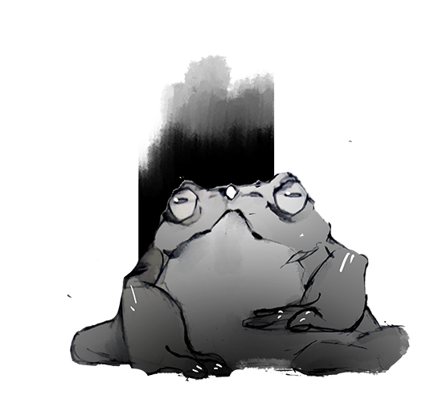
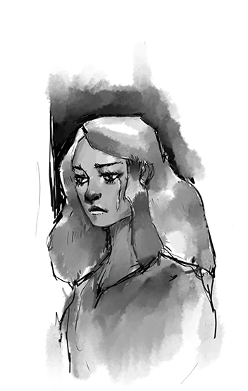
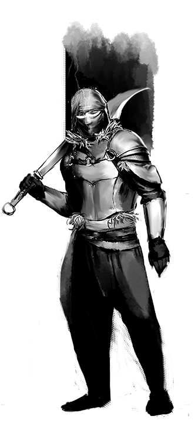

## Контекст
Я пам'ятаю цю ніч у грудні. Вона все ще відкликається у мене глибоко в серці. Це був справжній іспит для мене як для майстера. В грі було 2 нових гравці, і водив я ваншот, який по доброму треба було би розтягнути на 4 сесії. Замість цього ми грали з 15:00 першого дня до 8й ранка другого. Такої кількісті енергетиків я не пив ніколи і сподіваюсь не буду пити ніколи після.

Але гравці були у повному захваті. Недовго думаючи ми вирішили, що це потрібно передати нашим нащадкам і, можливо, заробити на цьому гроші.

## Як воно було
Це насамперед замислювалось як комерційний проект. Тому ми писали англійською і запостили на дмсгілд і, сподіваючись заробити пару сотень долларів. У мене з англійською все було непогано, але недостатньо для того щоб люди  могли насолоджуватись моєю писаниною.

Тому до нас доєднався третій постійний член групи - редактор Влад, який жив в Лондоні і був практично native speaker (хоча сам він з Молдови). Це дорога мені людина, мій ментор та добрий друг, з яким ми колись грали в Hots та DoTA2. І мріяли разом поїхати на The International та випити разом пива.

Разом ми перенесли на бумагу всі ті пригоди що з нами трапились за ту добу. І почали довгий і напружений процес вичитки та полірування.

## Загальне
Метою ваншота було розширення Ацило. Я хотів показати, що ніби життя є і в країнах де група навряд чи коли-небудь побуває. І ті події ще повинні були вплинути на основний кампейн. . УХХХХХ у мене було ідей.

Ми перенеслись у далекий північний город під назвою... Кромвель. Це останній форпост людства у цих землях. Далі тільки сніг, монстри та артефакт Ноіта категорії S, який щойно помітили на магічних радарах. Группа повинна була дістатися цілі та телепортуватись геть. Єдина складність, що ворожа організація вже почала полювання і прибула туди раніше ніж наші. Тому треба поквапитись!

Вперше мої гравці почували себе не бомжами, а цілком повноважними членами суспільства. Я відсипав артефактів та золота, вони були членами вельми поважного угрупуванням мисливців за артефактами.

## Зміст
Саме ж місто було дуже ворожим. Одразу ж за гравцями починаяться стеження, добути транспорт це окремий квест. В дорозі ж їх очікує: засада разом гігантським крабом, пурга, гостинні великані, мертва таверна. А також підземелля та велика і грандіозна битва на замерзлому озері!

Масштаб був точно не ваншотний. Але мені дуже сподобалось як в той момент ігрові механіки почали взаємодіяти з наративом. У мене було пояснення абсолютно на все. Чому великий краб був частиною засідки? Тому що бандити купили його у друїда - контрабандиста. Чому краб вкритий татуюванням? Тому що це рідкий вимираючий вид і для того щоб їх не вбивали їх покривають гіпнотичним татуюванням. Чому коридор весь у пастках? Бо тут пройшли екзорцисти, які знали що за ними погоня. І так далі.

Найкраще, напевно, вийшли все ж таки бійки. Вперше я відчув, що локації для бою цікаві, складні та напружені. Тоді почала з'являтись концепція "слабкостей" ворогів, яка ляже в основу майбутнього [[Bestiary of very very strange mutants|бестиарію]].

Ми не заробили майже нічого. Але той досвід, той оргазм від народження твого проекту, доведення його до кінця я буду згадувати до кінця своїх днів.

Почитати Кромвель можна [тут](https://www.dmsguild.com/product/348435/Kromvel-Insanity-and-Courage)

Наступна сторінка - [Бестіарій дуже-дуже дивних мутантів]() 

Минула сторінка - [Первісний Хаос]() 